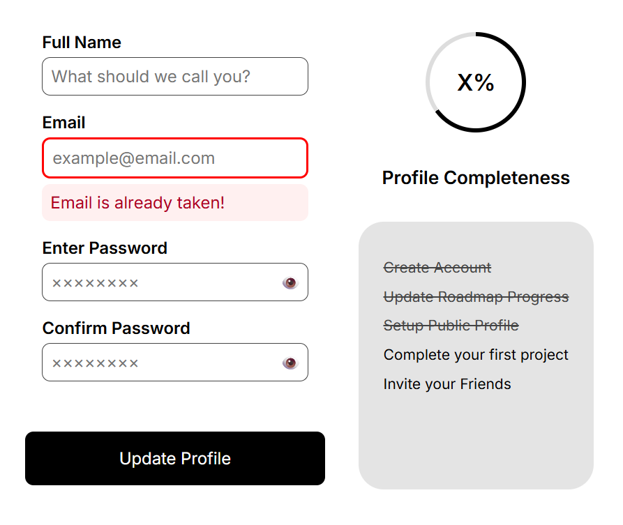

<h1 align="center">Accessible Form UI 📝<h1>

## Well styled, responsive, and accessible form UI

### A Frontend Project by [roadmap.sh](https://roadmap.sh/frontend/projects)

### In this project I used topics below:

-   Labeling
-   Focus State
-   Error Messaging
-   ARIA Attributes
-   Color Contrast
-   Interactive Elements (no JavaScript)

### Use `live-server` on `index.html` path to see the result

### `live-server` global installation with npm : `npm install -g live-server`
