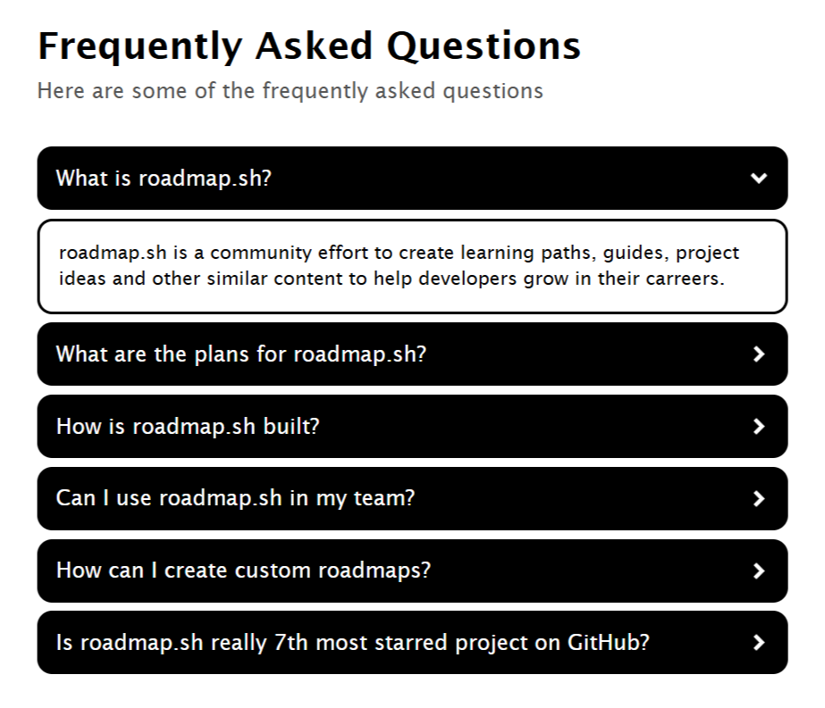

<h1 align="center"> Accordion 🗂️<h1>

## An accordion component using HTML, CSS, and JavaScript

### A Frontend Project by [roadmap.sh](https://roadmap.sh/frontend/projects)

### In this project I used topics below:

-   DOM manipulating and handling events
-   Clean and organized UI
-   Full responsive layout with CSS media queries
-   Soft and smooth transition on changing UI

### Use `live-server` on `index.html` path to see the result

### `live-server` global installation with npm : `npm install -g live-server`

### Please vote for the project with [THIS URL]() if it was useful.

### Thanks for your visit ❤️
