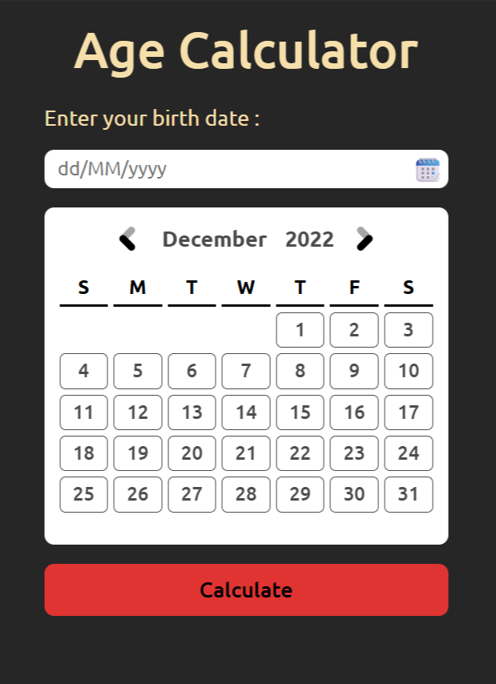

<h1 align="center"> Age Calculator 🗓️<h1>

## An age calculator using HTML, CSS, and JavaScript

### A Frontend Project by [roadmap.sh](https://roadmap.sh/frontend/projects)

### In this project I used topics below:

-   NPM package manager and Luxon package for DateTime format
-   Form with custom datepicker for date input
-   Display result on same page when user submit the form
-   Validating on date input and showing proper feedback on errors
-   Responsive Layout and suitable for all type of screens

### Use `live-server` on `index.html` path to see the result

### `live-server` global installation with npm : `npm install -g live-server`

### Please vote for the project with [THIS URL]() if it was useful.

### Thanks for your visit ❤️
