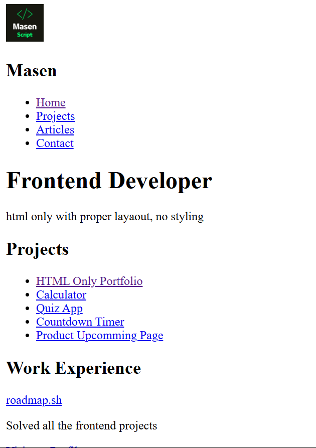

<h1 align="center">Basic HTML Website 📝<h1>

## A multipage HTML only website showcase my HTML skills

### No CSS used in this project!

### A Frontend Project defined by [roadmap.sh](https://roadmap.sh/frontend/projects)

### In this project I used topics below:

-   Multiple pages for each important section of website
-   Semantic tags for better structure of html document
-   CSS classes for future styles
-   Meta tags for SEO
-   Using html forms

### Use `live-server` on `index.html` path to see the result

### `live-server` global installation with npm : `npm install -g live-server`
