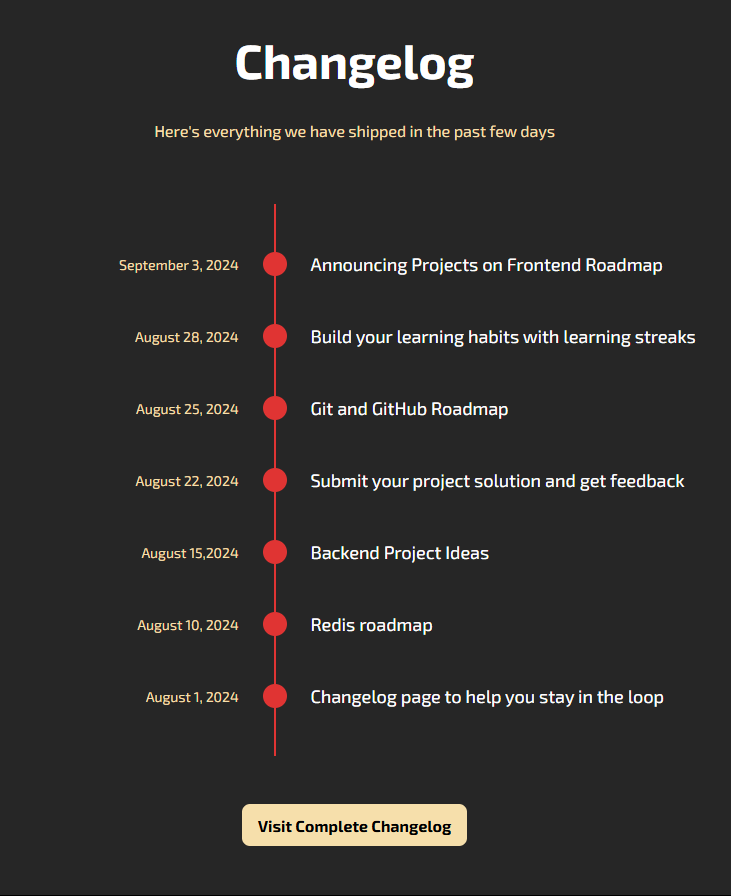

<h1 align="center">Changelog Component 📝<h1>

### A Simple Changelog Component to show a process steps

### Fully styled page with proper responsive layout

### A Frontend Project by [roadmap.sh](https://roadmap.sh/frontend/projects)

### In this project I used topics below:

-   ...
-   ...
-   ...

### Use `live-server` on `index.html` path to see the result

### `live-server` global installation with npm : `npm install -g live-server`
