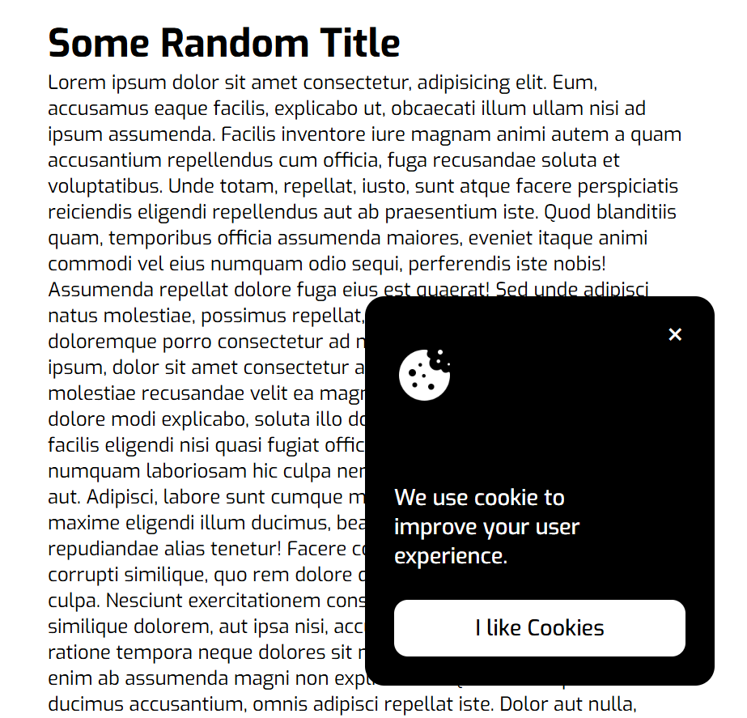

<h1 align="center"> Coockie Consent ⚙️<h1>

## A simple cookie consent banner using JavaScript

### A Frontend Project by [roadmap.sh](https://roadmap.sh/frontend/projects)

### In this project I used topics below:

-   DOM manipulation and event handling with JavaScript
-   Using localStorage and load event for set a constant state for cookie
-   Set expiration time for cookie and using Date object to handle expiration
-   Using fixed positioning for cookie popup window
-   responsive layout using media queries

### Use `live-server` on `index.html` path to see the result

### `live-server` global installation with npm : `npm install -g live-server`
