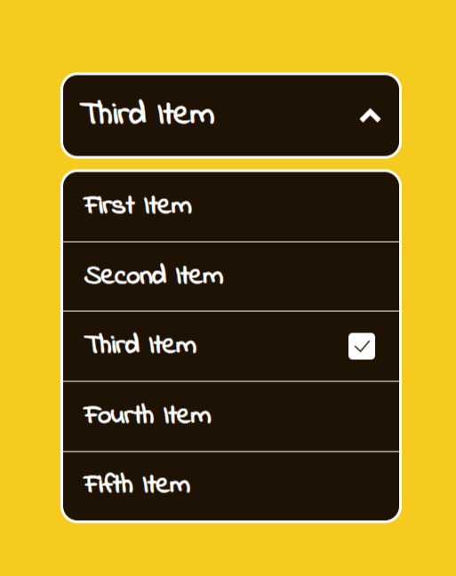

<h1 align="center"> Custom Dropdown 🗄️<h1>

## A custom dropdown using HTML, CSS, and JavaScript

### A Frontend Project by [roadmap.sh](https://roadmap.sh/frontend/projects)

### In this project I used topics below:

-   DOM manipulating
-   Event Handling
-   Responsive and Interactive element using JavaScript

### Use `live-server` on `index.html` path to see the result

### `live-server` global installation with npm : `npm install -g live-server`

### Please vote for the project with [THIS URL](https://roadmap.sh/projects/custom-dropdown/solutions?u=66107474da1671f986289b45) if it was useful.

### Thanks for your visit ❤️
