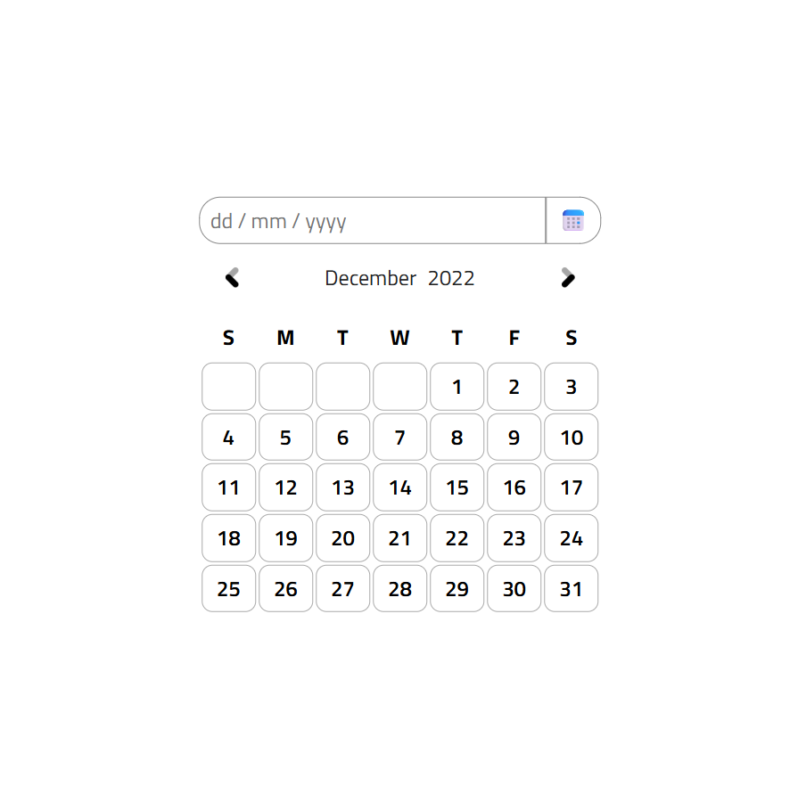

<h1 align="center">Datepicker UI 📝<h1>

## A Datepicker with HTML and CSS

### A Frontend Project by [roadmap.sh](https://roadmap.sh/frontend/projects)

### In this project I used topics below:

-   Positioning and Layout in CSS
-   HTML table handling
-   HTML input handling
-   Styling techniques for a better look
-   Smooth and user friendly UI
-   Responsive Style

### Use `live-server` on `index.html` path to see the result

### `live-server` global installation with npm : `npm install -g live-server`
