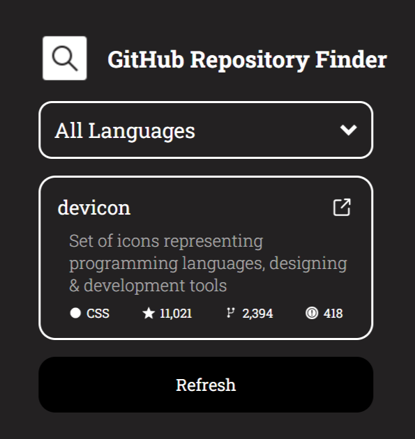

<h1 align="center"> GitHub Random Repository 🎲<h1>

## A GitHub random repository finder using GitHub API

### A Frontend Project by [roadmap.sh](https://roadmap.sh/frontend/projects)

### In this project I used topics below:

-   Using CSS animation for loading status
-   Using JavaScript module for separating data from main app
-   Handling error status with try catch blocks and suitable UI
-   Asynchronous JavaScript and fetch API for obtaining data for app
-   Using previous component(custom dropdown) for better UI
-   I used [GitHub Repository Search API](https://docs.github.com/en/rest/reference/search#search-repositories) for this project

### Use `live-server` on `index.html` path to see the result

### `live-server` global installation with npm : `npm install -g live-server`

### Please vote for the project with [THIS URL](https://roadmap.sh/projects/github-random-repo/solutions?u=66107474da1671f986289b45) if it was useful.

### Thanks for your visit ❤️
