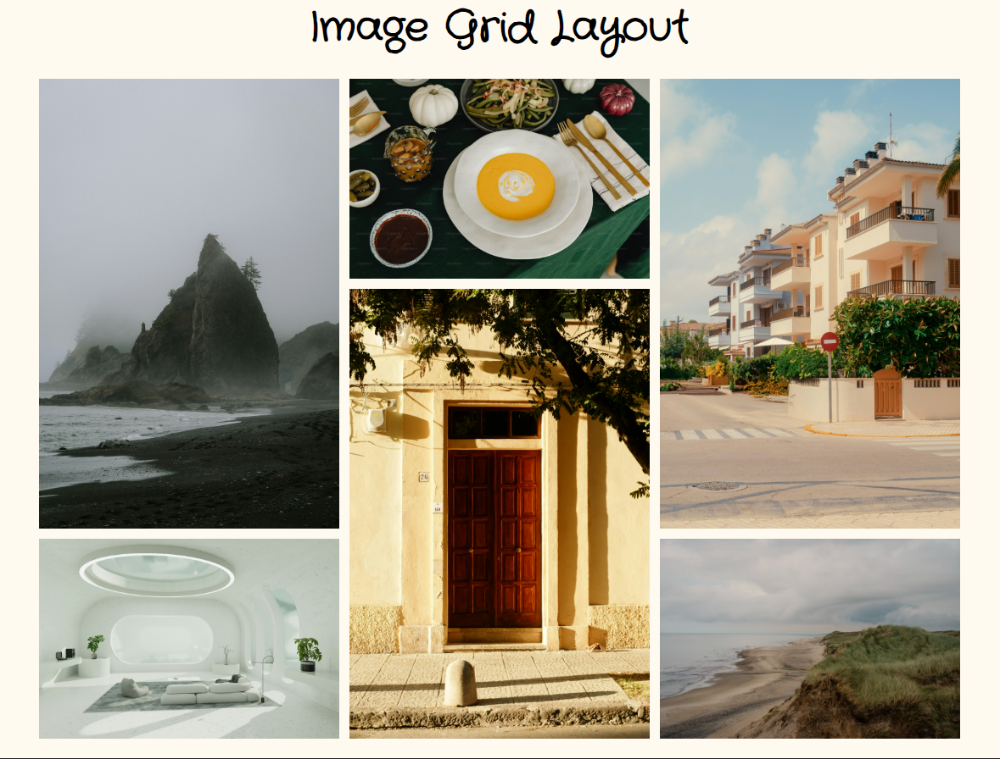

<h1 align="center">Image Grid Layout 🖼️<h1>

## A grid layout of images using HTML and CSS

### A Frontend Project by [roadmap.sh](https://roadmap.sh/frontend/projects)

### In this project I used topics below:

-   CSS grid to positioning the images
-   [google font](https://fonts.google.com/) for typography
-   responsive layout for any screen using media queries

### Use `live-server` on `index.html` path to see the result

### `live-server` global installation with npm : `npm install -g live-server`

### Please vote for the project with [THIS URL](https://roadmap.sh/projects/image-grid/solutions?u=66107474da1671f986289b45) if it was useful.

### Thanks for your visit ❤️
