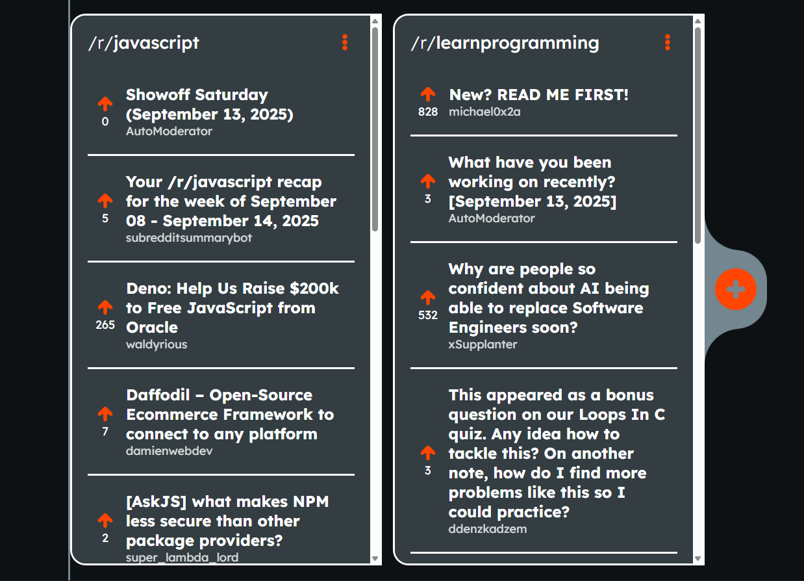

<h1 align="center"> Reddit Client 🤖<h1>

## A Reddit client with customizable subreddit lanes

### A Frontend Project by [roadmap.sh](https://roadmap.sh/frontend/projects)

### In this project I used topics below:

-   Async JavaScript and handling API requests
-   Filtering API limits with an express JS backend server
-   Using a dynamic responsive layout for showing the result
-   Verification on names and handling errors
-   Handling loading states
-   Using local storage for saving user data and restore on reloading

### Use `live-server` on `index.html` path to see the result

### `live-server` global installation with npm : `npm install -g live-server`

### Please vote for the project with [THIS URL]() if it was useful.

### Thanks for your visit ❤️
