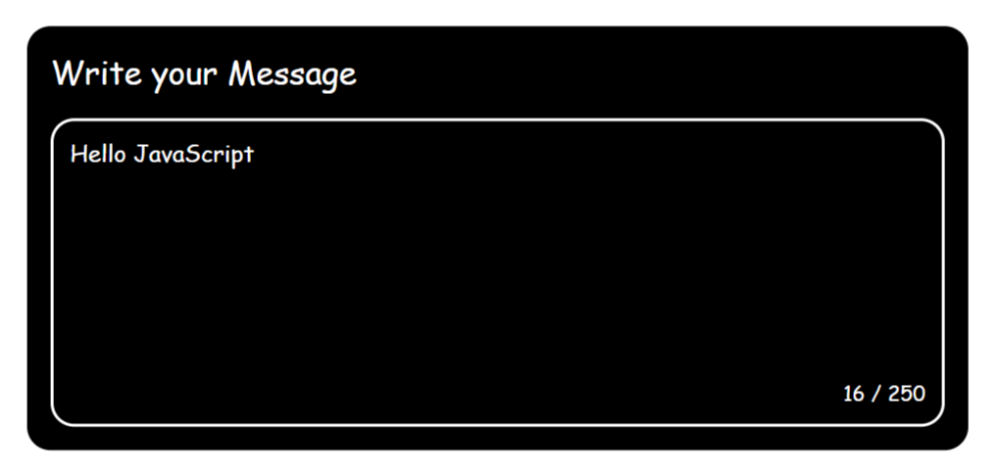

<h1 align="center"> Restricted Textarea 💬<h1>

## A textarea with live character count and a max character limit

### A Frontend Project by [roadmap.sh](https://roadmap.sh/frontend/projects)

### In this project I used topics below:

-   Handling user input event
-   Realtime feedback on typing
-   Initializing webpage with JS and DOM manipulating
-   Interactive UI and flexible on data changing (change the textarea maxlength attribute 😉)

### Use `live-server` on `index.html` path to see the result

### `live-server` global installation with npm : `npm install -g live-server`

### Please vote for the project with [THIS URL]() if it was useful.

### Thanks for your visit ❤️
