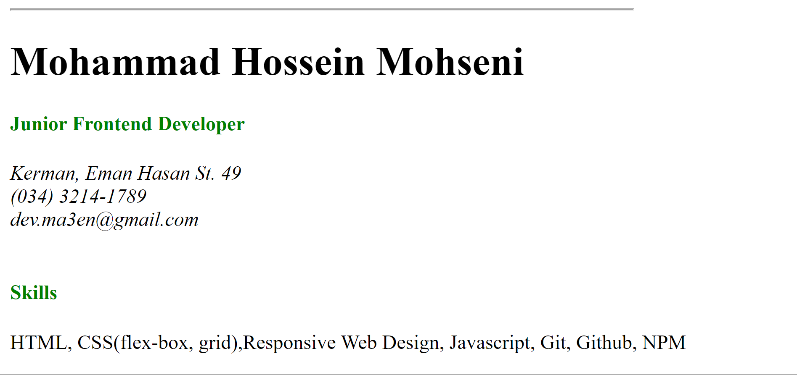

<h1 align="center">Single Page CV 📝<h1>

### A single-page HTML CV to showcase my career history

### No CSS used in this project (except some inline styles for color)

### A Frontend Project by [roadmap.sh](https://roadmap.sh/frontend/projects)

### In this project I used important topic below:

-   meta tags for SEO
-   OG tags for better sharing on social media
-   several favicons
-   semantic tags for better structure of html document

### Use `live-server` on `index.html` path to see the result

### `live-server` global installation with npm : `npm install -g live-server`
