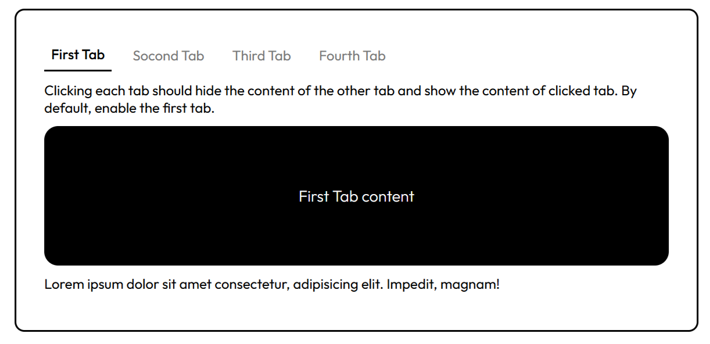

<h1 align="center"> Tabs ⚙️<h1>

## A simple tabs component using HTML, CSS, and JavaScript

### A Frontend Project by [roadmap.sh](https://roadmap.sh/frontend/projects)

### In this project I used topics below:

-   ...

### Use `live-server` on `index.html` path to see the result

### `live-server` global installation with npm : `npm install -g live-server`
