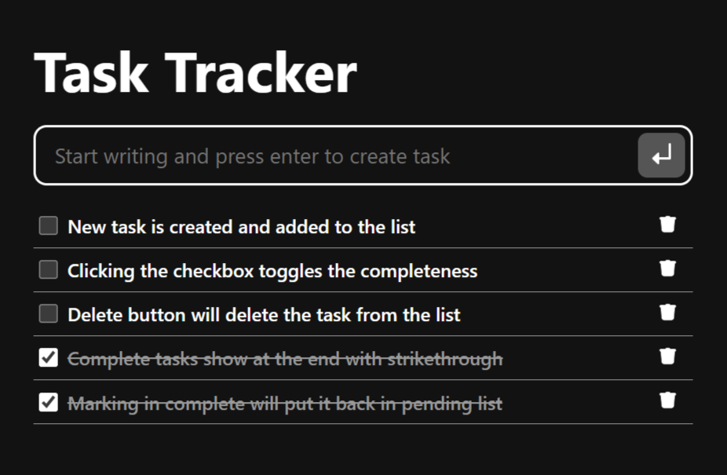

<h1 align="center"> Task Tracker ✅<h1>

## A task tracker with a to-do list using JavaScript

### A Frontend Project by [roadmap.sh](https://roadmap.sh/frontend/projects)

### In this project I used topics below:

-   Array manipulating
-   Event handling
-   Dynamic DOM updates

### Use `live-server` on `index.html` path to see the result

### `live-server` global installation with npm : `npm install -g live-server`

### Please vote for the project with [THIS URL](https://roadmap.sh/projects/task-tracker-js/solutions?u=66107474da1671f986289b45) if it was useful.

### Thanks for your visit ❤️
