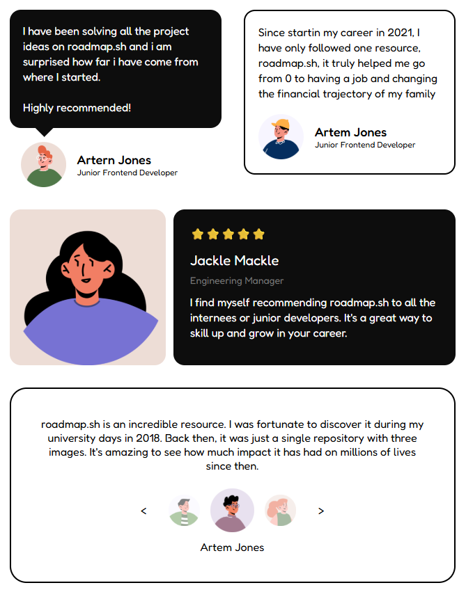

<h1 align="center">Testimonial Cards 🪪<h1>

## Well styled Testimonial Cards to show the credibility and trust.

### A Frontend Project by [roadmap.sh](https://roadmap.sh/frontend/projects)

### In this project I used topics below:

-   Positioning and layout in CSS
-   Flex-box and Grid layout
-   Responsive layout with proper positioning and media queries
-   CSS variables for colors
-   [Google Fonts](https://fonts.google.com/) for a better typography

### Use `live-server` on `index.html` path to see the result

### `live-server` global installation with npm : `npm install -g live-server`

### Please vote for the project with [THIS URL](https://roadmap.sh/projects/testimonial-cards/solutions?u=66107474da1671f986289b45) if it was useful.

### Thanks for your visit ❤️
