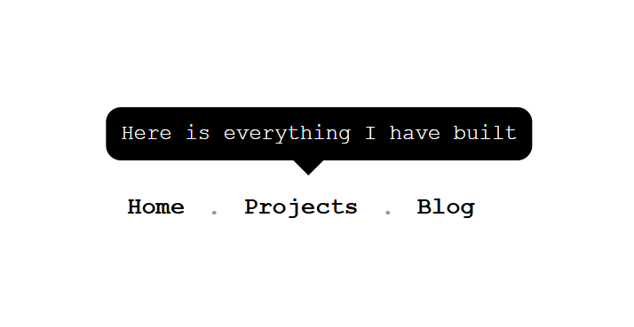

<h1 align="center"> Tooltip UI 🪧<h1>

## A tooltip for navigation items using only HTML and CSS.

### A Frontend Project by [roadmap.sh](https://roadmap.sh/frontend/projects)

### In this project I used topics below:

-   Absolute positioning and box model
-   CSS transform and transition for smooth little animations
-   Using CSS hover effect and engaging no JavaScript
-   Three smooth effect: slide-in , fade-in , scale-in

### Use `live-server` on `index.html` path to see the result

### `live-server` global installation with npm : `npm install -g live-server`

### Please vote for the project with [THIS URL](https://roadmap.sh/projects/tooltip-ui/solutions?u=66107474da1671f986289b45) if it was useful.

### Thanks for your visit ❤️
