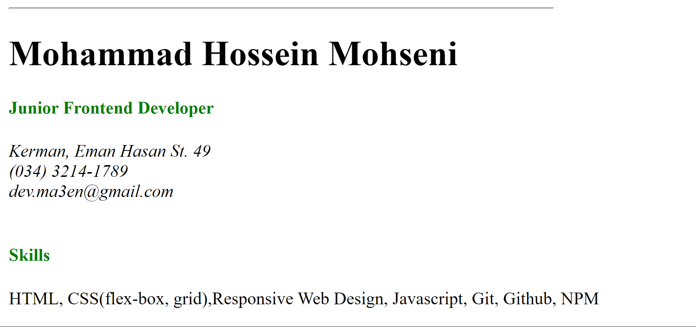
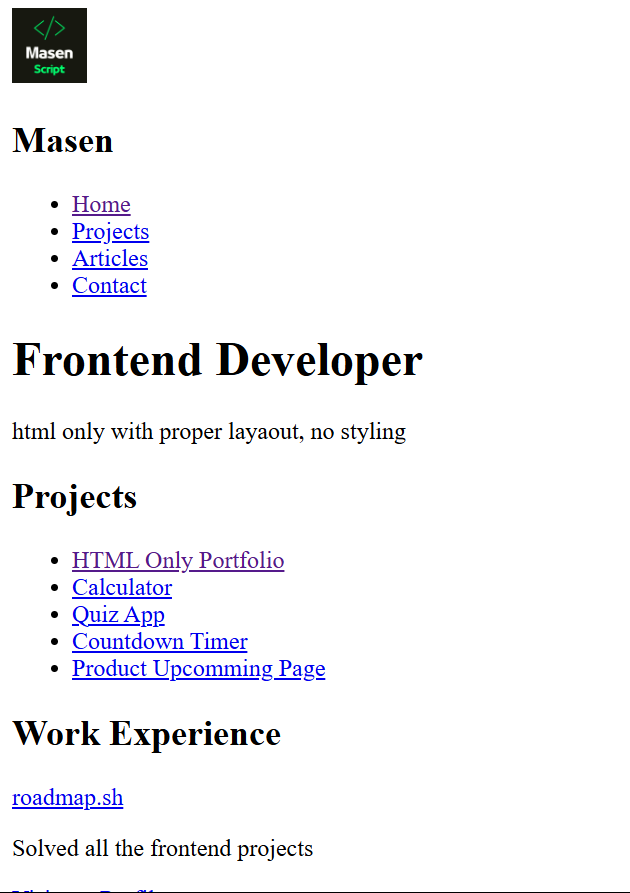
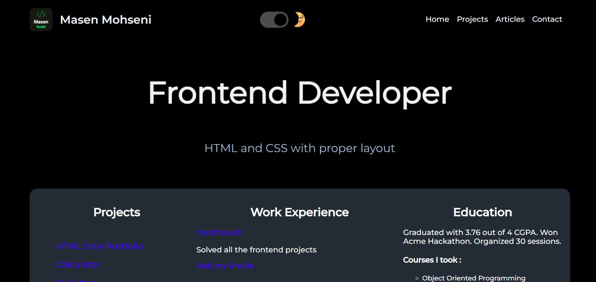

<h1 align="center"> Roadmap Frontend Projects 💻</h1>

## This is a repository for [roadmap.sh](https://roadmap.sh/) frontend projects

## Projects Definition:

-   Project 1 : [Single-Page CV](https://roadmap.sh/projects/single-page-cv)

-   Project 2 : [Basic HTML Website](https://roadmap.sh/projects/basic-html-website)

-   Project 3 : [Personal Portfolio](https://roadmap.sh/projects/portfolio-website)

-   Project 4 : [Changelog Component](https://roadmap.sh/projects/changelog-component)

---

## Projects :

  <!-- card 1 -->
  <figure style="margin:0; width:320px; border-radius:8px; overflow:hidden; box-shadow:0 6px 18px rgba(0,0,0,0.08);">
    
    <figcaption style="padding:12px 14px;">
      <h3 style="margin:0; font-size:1.05rem">Card Title One</h3>
      
Short caption or description for card one.

    </figcaption>
  </figure>

  <!-- card 2 -->
  <figure style="margin:0; width:320px; border-radius:8px; overflow:hidden; box-shadow:0 6px 18px rgba(0,0,0,0.08);">
    
    <figcaption style="padding:12px 14px;">
      <h3 style="margin:0; font-size:1.05rem">Card Title Two</h3>
      
Short caption or description for card two.

    </figcaption>
  </figure>

  <!-- card 3 -->
  <figure style="margin:0; width:320px; border-radius:8px; overflow:hidden; box-shadow:0 6px 18px rgba(0,0,0,0.08);">
    
    <figcaption style="padding:12px 14px;">
      <h3 style="margin:0; font-size:1.05rem">Card Title Three</h3>
      
Short caption or description for card three.

    </figcaption>
  </figure>

<!-- 

<a href="./Frontend_Projects/Single-Page-CV/" style="width:400px;height:250px;display:flex;flex-direction:column;background-color:#232323;text-decoration:none;color:#fff;padding:1.5rem;border-radius:1rem;">

<h2>Single-Page CV</h2>
</a>

<a href="./Frontend_Projects/Basic-HTML-Website/" style="width:400px;height:250px;display:flex;flex-direction:column;background-color:#232323;text-decoration:none;color:#fff;padding:1.5rem;border-radius:1rem;">

<h2>Basic HTML Website</h2>
</a>

<a href="./Frontend_Projects/Personal_Portfolio/" style="width:400px;height:250px;display:flex;flex-direction:column;background-color:#232323;text-decoration:none;color:#fff;padding:1.5rem;border-radius:1rem;">

<h2>Personal Portfolio</h2>
</a>

<a href="./Frontend_Projects/Changelog-Component/" style="width:400px;height:250px;display:flex;flex-direction:column;background-color:#232323;text-decoration:none;color:#fff;padding:1.5rem;border-radius:1rem;">

<h2>Changelog Component</h2>
</a>

 -->
