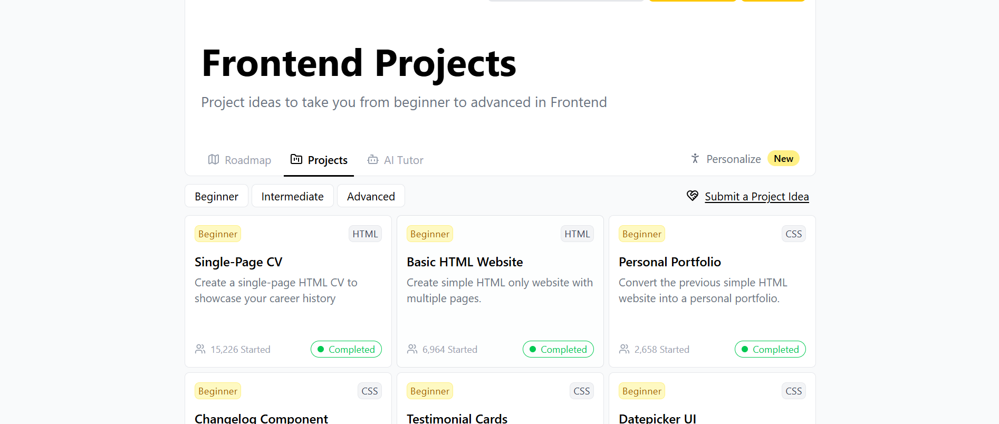
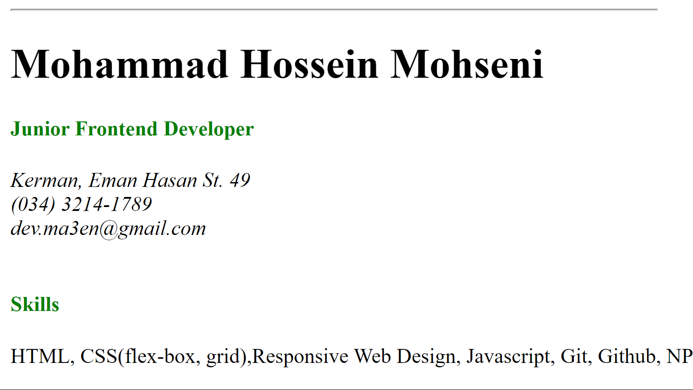
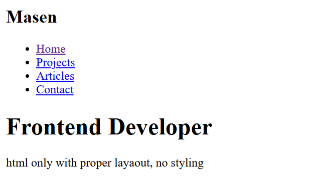
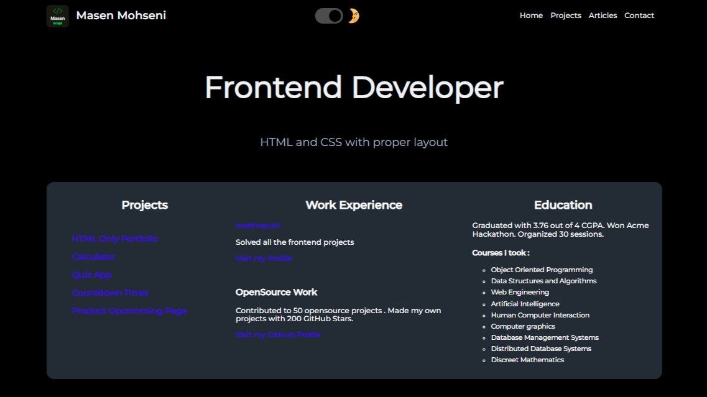

<h1 align="center"> Roadmap Frontend Projects 💻</h1>

## This is a repository for [roadmap.sh](https://roadmap.sh/) frontend projects

## Projects Definition:

-   Project 1 : [Single-Page CV](https://roadmap.sh/projects/single-page-cv)

-   Project 2 : [Basic HTML Website](https://roadmap.sh/projects/basic-html-website)

-   Project 3 : [Personal Portfolio](https://roadmap.sh/projects/portfolio-website)

-   Project 4 : [Changelog Component](https://roadmap.sh/projects/changelog-component)

---

## Projects :

<table border="0" cellpadding="12" cellspacing="0" width="90%" align="center">
  <tr>
    <td align="center" valign="top">
      
        <h2>Single-Page CV</h2>
      
A single-page HTML CV to showcase my career history

    </td>
  </tr>
  <tr><td height="100px"></td></tr>
  <tr>
    <td align="center" valign="top">
      
        <h2>Basic HTML Website</h2>
      
Simple HTML only website with multiple pages

    </td>
  </tr>
  <tr><td height="100px"></td></tr>
  <tr>
    <td align="center" valign="top">
      
        <h2>Personal Portfolio</h2>
      
Converting the previous simple HTML website into a personal portfolio.

    </td>
  </tr>
  <tr><td height="100px"></td></tr>
  <tr>
    <td align="center" valign="top">
      
        <h2>Changelog Component</h2>
      
Changelog component for a website using HTML and CSS

    </td>
  </tr>
</table>
