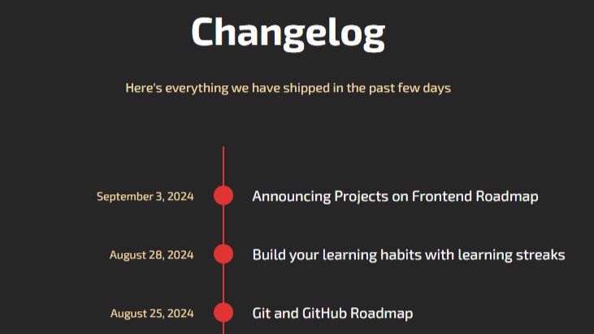
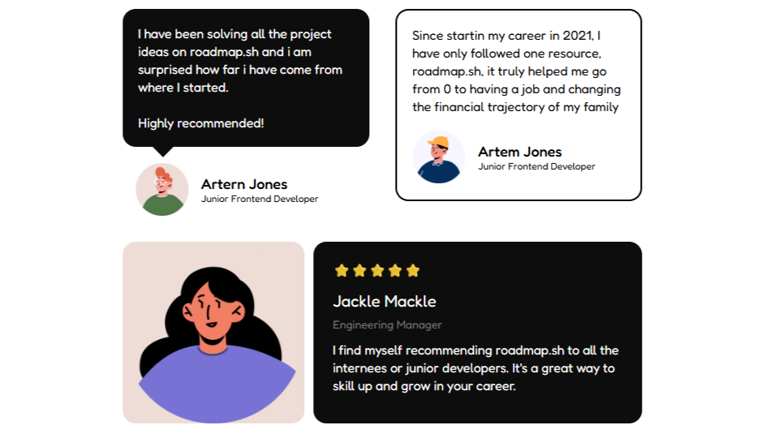
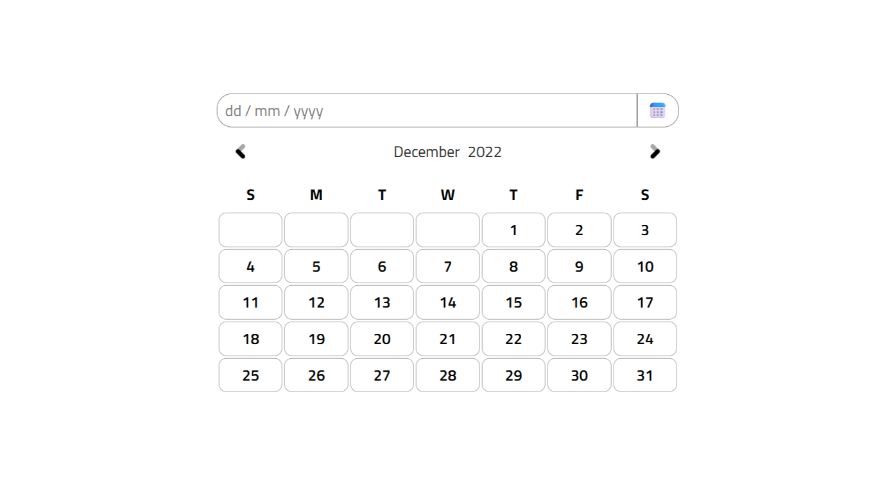
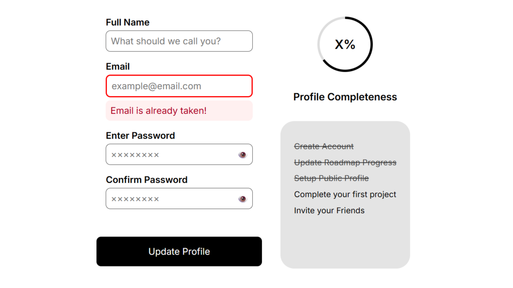
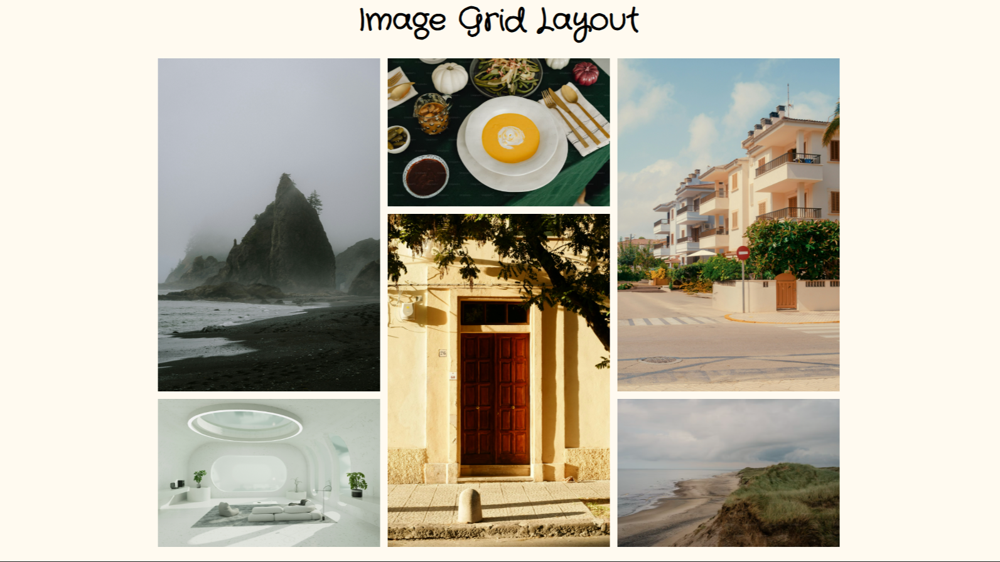

<h1 align="center"> Roadmap Frontend Projects 💻</h1>

## This is a repository for [roadmap.sh](https://roadmap.sh/) frontend projects

## Projects Definition:

-   Project 1 : [Single-Page CV](https://roadmap.sh/projects/single-page-cv)

-   Project 2 : [Basic HTML Website](https://roadmap.sh/projects/basic-html-website)

-   Project 3 : [Personal Portfolio](https://roadmap.sh/projects/portfolio-website)

-   Project 4 : [Changelog Component](https://roadmap.sh/projects/changelog-component)
-   Project 5 : [Testimonial Cards](https://roadmap.sh/projects/testimonial-cards)
-   Project 6 : [Datepicker UI](https://roadmap.sh/projects/datepicker-ui)
-   Project 7 : [Accessible Form UI](https://roadmap.sh/projects/accessible-form-ui)
-   Project 8 : [Image Grid Layout](https://roadmap.sh/projects/image-grid)

---

## Projects :

<table border="0" cellpadding="12" cellspacing="0" width="90%" align="center">
  <tr>
    <td align="center" valign="top">
      <a href="./Frontend_Projects/Single-Page-CV/">
        
        <h2>Single-Page CV</h2>
      </a>
      
A single-page HTML CV to showcase my career history

    </td>
  </tr>
  <tr><td height="100px"></td></tr>
  <tr>
    <td align="center" valign="top">
      <a href="./Frontend_Projects/Basic-HTML-Website/">
        
        <h2>Basic HTML Website</h2>
      </a>
      
Simple HTML only website with multiple pages

    </td>
  </tr>
  <tr><td height="100px"></td></tr>
  <tr>
    <td align="center" valign="top">
      <a href="./Frontend_Projects/Personal_Portfolio/">
        
        <h2>Personal Portfolio</h2>
      </a>
      
Converting the previous simple HTML website into a personal portfolio

    </td>
  </tr>
  <tr><td height="100px"></td></tr>
  <tr>
    <td align="center" valign="top">
      <a href="./Frontend_Projects/Changelog-Component/">
        
        <h2>Changelog Component</h2>
      </a>
      
Changelog component for a website using HTML and CSS

    </td>
  </tr>
  <tr><td height="100px"></td></tr>
  <tr>
    <td align="center" valign="top">
      <a href="./Frontend_Projects/Testimonial-Cards/">
        
        <h2>Testimonial Cards</h2>
      </a>
      
Testimonial cards for a website using HTML and CSS

    </td>
  </tr>
  <tr><td height="100px"></td></tr>
  <tr>
    <td align="center" valign="top">
      <a href="./Frontend_Projects/Datepicker-UI/">
        
        <h2>Datepicker UI</h2>
      </a>
      
A simple datepicker UI using HTML and CSS

    </td>
  </tr>
  <tr><td height="100px"></td></tr>
  <tr>
    <td align="center" valign="top">
      <a href="./Frontend_Projects/Accessible-Form-UI/">
        
        <h2>Accessible Form UI</h2>
      </a>
      
An accessible form UI using HTML and CSS

    </td>
  </tr>
  <tr><td height="100px"></td></tr>
  <tr>
    <td align="center" valign="top">
      <a href="./Frontend_Projects/Image-Grid-Layout/">
        
        <h2>Image Grid Layout</h2>
      </a>
      
A grid layout of images using HTML and CSS

    </td>
  </tr>
</table>
